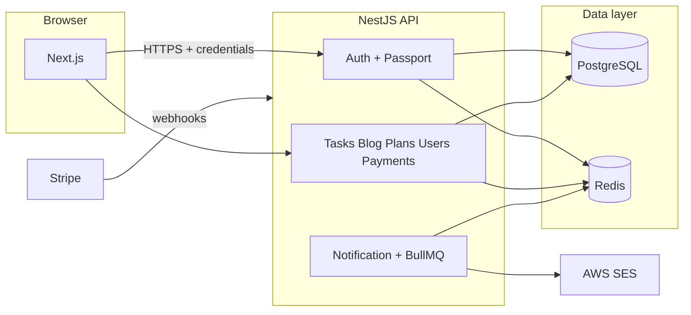

<div align="center">

# Task Manager

A **production-style full-stack task management platform** built to practice modern backend and frontend engineering: a clear API boundary, real persistence, caching, background jobs, payments, and first-class authentication.

[](https://nodejs.org/)
[](https://nestjs.com/)
[](https://nextjs.org/)
[](https://pnpm.io/)

[Repository](https://github.com/bogdan19981305/task-manager) · [Issues](https://github.com/bogdan19981305/task-manager/issues)

</div>

---

## Overview

This monorepository splits concerns the way many real products do: a **NestJS** REST API owns business rules, data access, and integrations; a **Next.js** application delivers the UI and talks to the API over HTTP with **credentials-aware** requests so authentication can stay in **httpOnly cookies**.

The stack is intentionally “batteries included”: **PostgreSQL** for durable state, **Redis** for cache, rate-limit storage, and refresh-token material, **BullMQ** for asynchronous work (e.g. email), and **Stripe** for subscriptions or one-off flows wired through a dedicated webhook pipeline. The project is a solid reference for **Docker-based** local and server workflows, **Prisma** schema evolution, and **GitHub Actions** automation.

**Who is it for?** Developers who want a single codebase that touches auth, CRUD, admin-style features (plans, blog), payments, queues, and deployment—not a toy todo list, but something closer to a small SaaS skeleton.

---

## Table of contents

- [Features](#features)
- [Architecture](#architecture)
- [Tech stack](#tech-stack)
- [Repository layout](#repository-layout)
- [Prerequisites](#prerequisites)
- [Quick start (Docker)](#quick-start-docker)
- [Local development without Docker](#local-development-without-docker)
- [Makefile shortcuts](#makefile-shortcuts)
- [Environment variables](#environment-variables)
- [API & documentation](#api--documentation)
- [Security & auth notes](#security--auth-notes)
- [Database (Prisma)](#database-prisma)
- [Testing & CI](#testing--ci)
- [Deployment](#deployment)
- [Troubleshooting](#troubleshooting)
- [License](#license)

---

## Features

| Area                    | What you get                                                                                                                                                                                           |
| ----------------------- | ------------------------------------------------------------------------------------------------------------------------------------------------------------------------------------------------------ |
| **Tasks**               | Full task lifecycle: create, update, list, assignee and creator relations, status workflow; list responses can be cached in Redis for responsiveness.                                                  |
| **Authentication**      | Email/password registration and login; **JWT** access tokens; **refresh tokens** stored server-side (hashed in Redis) and mirrored in **httpOnly** cookies; **Google** and **GitHub** OAuth redirects. |
| **Users & roles**       | User model with **roles** (e.g. admin vs user); backend guards and frontend route groups align with protected areas.                                                                                   |
| **Plans & billing**     | Plan catalog with Stripe price/product linkage; checkout-oriented flows and **Stripe webhooks** (raw body preserved for signature verification).                                                       |
| **Blog**                | Published posts with **slugs**, public listing and detail pages; Redis-backed caching for reads.                                                                                                       |
| **Notifications**       | **BullMQ** workers and queues; transactional email via **AWS SES** (welcome and other flows).                                                                                                          |
| **Operational hygiene** | **Global rate limiting** (Throttler + Redis storage), **Helmet**, **ValidationPipe** (whitelist/transform), structured Nest modules, and **e2e** coverage for critical paths.                          |

### Frontend surface (high level)

Routes live under `frontend/app/`, grouped by intent:

- **Public** — landing, marketing (`about`, `contact`), **blog**, **pricing**, payment result pages.
- **Auth** — sign-in and sign-up.
- **Protected** — **dashboard**, **tasks**, **workspace**, **account**, **activity**, **notifications**, **integrations**, and **admin** areas such as plan management.

The UI uses **TanStack Query** for server state and an Axios instance configured for **cookie** sessions and **401 refresh** retry logic where appropriate.

---

## Architecture



- **API** exposes REST endpoints; CORS is locked to `FRONTEND_URL` with `credentials: true`.
- **Redis** serves three roles: HTTP cache keys for blog/tasks, **Throttler** storage (e.g. 100 requests / 60s per keyspace), and **refresh-token** hashes keyed by user.
- **BullMQ** uses the same Redis instance for queue connection; workers run in-process with the Nest app.
- **Stripe** webhooks hit a controller that needs the **raw** request body—`main.ts` enables `rawBody` on the Nest app for that integration.

---

## Tech stack

| Layer             | Choices                                                                                                                          |
| ----------------- | -------------------------------------------------------------------------------------------------------------------------------- |
| **API**           | NestJS 11, Prisma 7, class-validator, Swagger, Passport (JWT / Google / GitHub), cookie-parser                                   |
| **Data**          | PostgreSQL 16 (Docker), Redis 7                                                                                                  |
| **Async & email** | BullMQ, AWS SES                                                                                                                  |
| **Payments**      | Stripe (REST + webhooks)                                                                                                         |
| **UI**            | Next.js 16 (App Router), React 19, TanStack Query, Axios, Tailwind CSS 4, Radix / shadcn-style components, Zod + React Hook Form |
| **Tooling**       | pnpm 8, Docker Compose, GitHub Actions, Husky + lint-staged (repo root), ESLint + Prettier                                       |

---

## Repository layout

```
task-manager/
├── backend/
│   ├── prisma/                 # Schema, migrations, seeds
│   ├── src/
│   │   ├── auth/               # JWT, OAuth, Redis-backed refresh
│   │   ├── tasks/
│   │   ├── users/
│   │   ├── blog/
│   │   ├── plans/
│   │   ├── payments/           # Stripe + webhook (raw body)
│   │   ├── notification/       # Queues, SES
│   │   └── common/             # Redis, email helpers, etc.
│   └── test/                   # E2E (Jest + supertest)
├── frontend/
│   ├── app/                    # Routes: (public) / (protected) / auth
│   ├── widgets/
│   └── shared/                 # API client, paths, utilities
├── docker-compose.yml          # Dev: Postgres + Redis + backend (watch)
├── docker-compose.prod.yml     # Prod image + services
├── Makefile                    # Convenience targets (dev, prod, db, studio)
└── .github/workflows/          # CI (unit + e2e), deploy (SSH to AWS)
```

### Default ports

| Service                                        | Port   |
| ---------------------------------------------- | ------ |
| Nest API                                       | `3000` |
| Next.js (`pnpm dev`)                           | `3001` |
| PostgreSQL                                     | `5432` |
| Redis                                          | `6379` |
| Prisma Studio (optional, in backend container) | `5555` |

---

## Prerequisites

- **Node.js** 24+ (matches CI; local LTS usually works)
- **pnpm** 8 (see `packageManager` in `backend/package.json`)
- **Docker** + Docker Compose for the all-in-one dev stack
- Optional: **Make** for shorthand commands (`make dev`, `make prod-build`, …)

---

## Quick start (Docker)

1. **Backend env for Compose**

   ```bash
   cp backend/.env.docker.example backend/.env.docker
   ```

   Edit secrets (Postgres, `JWT_SECRET`, `REDIS_PASSWORD`, OAuth, Stripe, AWS) as needed.

2. **Start Postgres, Redis, and the API** (from repo root)

   ```bash
   docker compose up --build
   ```

   The backend container runs `pnpm install`, `prisma db push`, and `nest start --watch`.

3. **Frontend** (separate terminal)

   ```bash
   cp frontend/.env.example frontend/.env.local
   cd frontend && pnpm install && pnpm dev
   ```

4. **Open**
   - App: [http://localhost:3001](http://localhost:3001)
   - API: [http://localhost:3000](http://localhost:3000)
   - Swagger (when `NODE_ENV=development`): [http://localhost:3000/api/docs](http://localhost:3000/api/docs)

**Alternative:** `make dev-build` uses `backend/.env.docker` and starts the same stack in detached mode (see [Makefile](#makefile-shortcuts)).

---

## Local development without Docker

1. Run **PostgreSQL** and **Redis** yourself (native or minimal containers).
2. Create `backend/.env` modeled on `backend/.env.docker.example`:
   - Point `DATABASE_URL` at `localhost` (not the Docker hostname `postgres`).
   - Set `REDIS_HOST`, `REDIS_PORT`, `REDIS_PASSWORD`.
3. Backend:

   ```bash
   cd backend
   pnpm install
   pnpm db:push
   pnpm start:dev
   ```

4. Frontend:

   ```bash
   cd frontend
   pnpm install
   pnpm dev
   ```

Set `NEXT_PUBLIC_API_URL` to your API origin (default example: `http://localhost:3000`).

---

## Makefile shortcuts

Common targets from the **repository root** (see `Makefile` for the full list):

| Target                                         | Purpose                                                             |
| ---------------------------------------------- | ------------------------------------------------------------------- |
| `make dev` / `make dev-build`                  | Start dev stack (with optional rebuild) using `backend/.env.docker` |
| `make prod` / `make prod-build`                | Start production compose with `backend/.env.prod.docker`            |
| `make down` / `make down-prod`                 | Stop dev or prod stack                                              |
| `make migrate` / `make migrate-prod`           | Prisma migrate inside the running backend container                 |
| `make db-push` / `make db-push-prod`           | `prisma db push` in container                                       |
| `make seed`, `make seed-dev`, `make seed-prod` | Run Prisma seed against running stack                               |
| `make studio`                                  | Start Prisma Studio on port 5555 inside backend container           |
| `make frontend`                                | `pnpm dev` in `frontend/`                                           |
| `make status`                                  | Quick check whether backend is dev vs prod mode and DB up           |

---

## Environment variables

Canonical templates:

| File                                                                   | Use case                              |
| ---------------------------------------------------------------------- | ------------------------------------- |
| [`backend/.env.docker.example`](backend/.env.docker.example)           | Local Docker Compose (development)    |
| [`backend/.env.prod.docker.example`](backend/.env.prod.docker.example) | Production Compose                    |
| [`frontend/.env.example`](frontend/.env.example)                       | `NEXT_PUBLIC_API_URL` for the browser |

**Backend groups to configure:**

- **Database:** `DATABASE_URL` and/or `POSTGRES_*` as in your compose file.
- **Auth:** `JWT_SECRET`, `JWT_EXPIRES`, callback URLs for OAuth providers.
- **CORS / cookies:** `FRONTEND_URL` must match the exact origin the browser uses (scheme + host + port).
- **Redis:** `REDIS_HOST`, `REDIS_PORT`, `REDIS_PASSWORD` (used by cache, throttler, BullMQ, refresh tokens).
- **Email:** `AWS_REGION`, `AWS_ACCESS_KEY_ID`, `AWS_SECRET_ACCESS_KEY`, `EMAIL_FROM`.
- **Stripe:** secret key, publishable key (if used client-side), success/cancel URLs, **webhook signing secret**.

---

## API & documentation

- REST handlers are registered at the **application root** (no global `/api` prefix in `main.ts`).
- **Swagger UI** is mounted at `/api/docs` only when `NODE_ENV=development`.
- **Cookies:** `access_token` and `refresh_token` are **httpOnly**; the frontend Axios client should send `withCredentials: true` (already wired in this repo) so refreshes and mutations keep the session.

---

## Security & auth notes

- Passwords are hashed with **bcrypt**; refresh token **hashes** live in Redis and expire with the refresh policy configured in code.
- **Production** cookies use `secure` and `sameSite: 'none'` where appropriate for cross-site setups; align `FRONTEND_URL` and HTTPS in real deployments.
- **Throttling** is enforced globally via `ThrottlerGuard` with Redis-backed storage to work across multiple instances.
- **Helmet** sets baseline HTTP headers; combine with a reverse proxy (TLS, HSTS) in production.

---

## Database (Prisma)

- Schema lives in `backend/prisma/schema.prisma`; client output is generated under `backend/src/generated/prisma`.
- **Development** often uses `pnpm db:push` for speed; **production** Compose runs `prisma migrate deploy` when migrations exist, otherwise falls back to `db push` (see `docker-compose.prod.yml`).
- **Studio:** `pnpm db:start` locally, or `make studio` when the backend runs in Docker.

---

## Testing & CI

| Type           | Command / location                                                                                           |
| -------------- | ------------------------------------------------------------------------------------------------------------ |
| **Unit tests** | `cd backend && pnpm test` (Jest, `src/**/*.spec.ts`)                                                         |
| **E2E**        | `cd backend && pnpm test:e2e` — uses `test/.env.test` and [`test/jest-e2e.json`](backend/test/jest-e2e.json) |

**GitHub Actions** ([`.github/workflows/ci.yml`](.github/workflows/ci.yml)) on pull requests to `main`:

- **Unit tests** job: install, `prisma generate`, `pnpm test` (optional Telegram notifications on success/failure).
- **E2E job**: Postgres 15 + Redis 7 services, generated `test/.env.test`, then `pnpm test:e2e`.

Run e2e locally only after creating `backend/test/.env.test` (see `backend/test/.env.test.example`).

---

## Deployment

The workflow [`.github/workflows/deploy.yml`](.github/workflows/deploy.yml) runs on **push to `main`**: it SSHs into a host and runs `git pull`, **`make prod-build`**, and Docker image pruning. Required GitHub secrets: `SSH_HOST`, `SSH_USERNAME`, `SSH_PRIVATE_KEY`, plus optional Telegram bot secrets if you keep notifications.

On the server, production stack expectations:

- `backend/.env.prod.docker` present and aligned with real domains and Stripe webhook URL.
- TLS termination (e.g. reverse proxy) in front of the API and frontend as you prefer.

---

## Troubleshooting

| Symptom                   | Things to check                                                                                               |
| ------------------------- | ------------------------------------------------------------------------------------------------------------- |
| CORS or cookies not sent  | `FRONTEND_URL` exact match; HTTPS + `SameSite` in production; Axios `withCredentials`.                        |
| Refresh fails immediately | Redis reachable; user still has a refresh hash in Redis; clock skew minimal.                                  |
| Stripe webhook 4xx        | Raw body middleware, correct `STRIPE_WEBHOOK_SECRET`, public URL reachable from Stripe.                       |
| E2E fails locally         | `test/.env.test` exists; Postgres/Redis URLs point to running services; test DB name matches CI expectations. |
| Prisma errors after pull  | `pnpm prisma generate` in `backend`; run migrations or `db push` as appropriate.                              |

---

## License

Root `package.json` is **ISC**; the `backend` package is marked **UNLICENSED** (private). Adjust before open-sourcing or redistributing.

---

<div align="center">

Built as a **learning-oriented, production-style** codebase—front and API separated, queues and payments real enough to trace end-to-end, and automation that mirrors how small teams ship.

</div>
